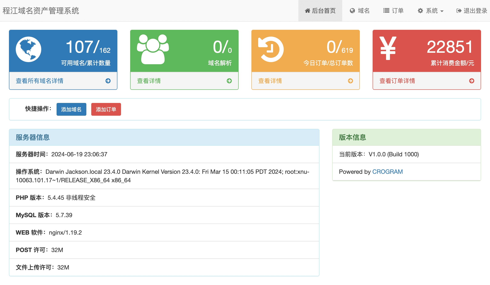

# 程江域名资产管理系统

DouName 是一款基于 PHP+MySQL 开发的域名资产管理系统。通过本系统，轻松实现在一个管理端，对不同厂商的域名进行基本信息、域名订单以及 DNS 解析的管理。

## 功能列表

1. 域名管理：添加和编辑域名，进行域名基本信息（域名、备案信息）管理；
2. 域名 Whois 查询工具；
3. 域名订单管理：添加和编辑订单信息；

## 预览截图



## 开发计划

1. 域名 Whois 信息同步到本地功能：注册时间、到期时间以及注册商等信息；
2. 域名备案查询；
3. 域名备案本地同步功能；
4. 域名证书申请和续期管理；
5. 对接主流域名注册商，通过接口同步域名到本地；
6. 对接主流域名注册商，通过接口同步和修改域名 DNS 解析记录；
7. 对接主流域名注册商，通过接口同步域名订单信息；

### 部署方法

- 运行环境要求 PHP5.4+，MySQL5.6+
- 将 `src` 目录内文件全部上传到网站运行目录
- 访问网站，会自动跳转到安装页面，根据提示填写配置信息，进行安装
- 安装完成后，访问 /admin 进入后台管理
- 设置伪静态，规则见下方

### 伪静态规则

- Nginx

```nginx
location / {
  if (!-e $request_filename) {
    rewrite ^(.*)$ /index.php?s=$1 last; break;
  }
}
```

- Apache

```xml
<IfModule mod_rewrite.c>
  Options +FollowSymlinks -Multiviews
  RewriteEngine On

  RewriteCond %{REQUEST_FILENAME} !-d
  RewriteCond %{REQUEST_FILENAME} !-f
  RewriteRule ^(.*)$ index.php/$1 [QSA,PT,L]
</IfModule>
```

### 赞助项目

开源不易, 有了您的赞助, 我们会做的更好。转账时请备注您的称呼，方便我们在网站 [https://crogram.org/sponsors](https://crogram.org/sponsors.html) 上展示。


## 开源许可

DouName 采用 [BSD](./LICENSE) 许可发布。个人使用无限制。商业使用请联系我们获得授权许可。

## 作者

[Jackson Dou](https://github.com/jksdou 'Jackson Dou')

### 版权信息

版权所有 Copyright © 2023 [CROGRAM](https://crogram.com)
